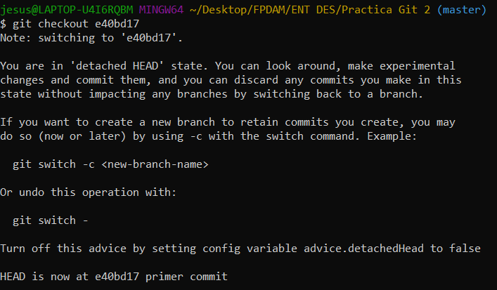
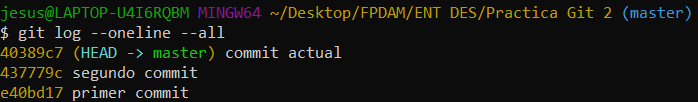

# Revisar Commits Realizados
Para este ejercicio, utilizaremos un nuevo repositorio e iremos consultando los diferentes commits que se han hecho.

# 1. Contenido del README.md en el primer commit

Si utilizamos el comando:

~~~
cat README.md
~~~

Éste debería ser el resultado:

# 2. Cambiar al commit anterior

Para abrir el commit anterior, primero debemos saber la cabecera de ese commit. Para ello, utilizamos el comando:

~~~
git checkout *cabecera*
~~~
En mi caso:

Por lo tanto, si ejecuto el comando:

~~~
cat README.md
~~~

El resultado es:

# 3. Vamos a movernos al segundo commit

Para posicionarnos en el segundo commit:

 ~~~
git checkout *cabecera 2*
 ~~~

Y el README es:

# 4. Commit actual
Finalmente, si queremos ver el commit actual:

~~~
git checkout master
~~~

Y el README es:

